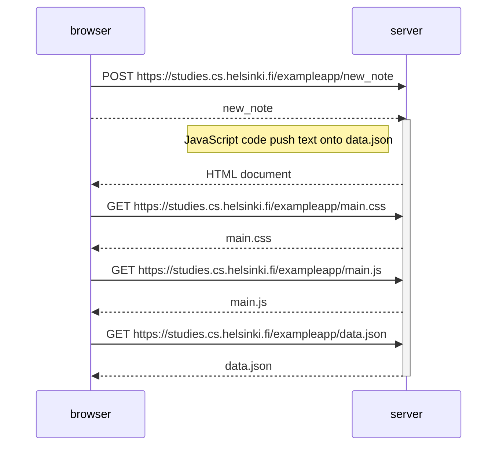

0.4: New note diagram
Create a similar diagram depicting the situation where the user creates a new note on the page https://studies.cs.helsinki.fi/exampleapp/notes by writing something into the text field and clicking the Save button.

When adding a new note to the form and clicking the Save button, the browser sends a POST request to the server with the new note. If I understood this well, the newly written text is saved in a file also called new_note and sent with the POST. It well may be that the POST request just contain the text string.

Whatever is sent, the server << reacts >> by calling javascript code to add the new text note and the date into the data.json file.

Inmediately, the server << redirects >> the notes web in a similar way than the GET request and the browser is responsible to render again the page.

