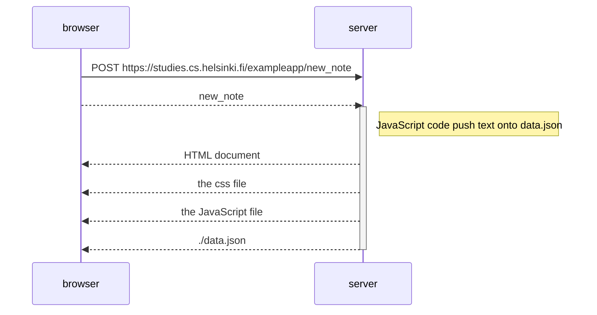

When adding a new note to the form and clicking the Save button, the browser sends a POST request to the server with the new note. If I understood this well, the newly written text is saved in a file also called new_note and sent with the POST. It well may be that the POST request just contain the text string. Whatever is sent, the server << reacts >> by calling javascript code to add the new text note and the date into the data.json file. Inmediately, the server << redirects >> the notes web in a similar way than the get

