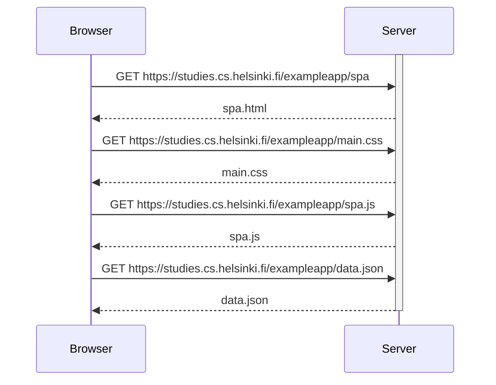

0.5: Single page app diagram
Create a diagram depicting the situation where the user goes to the single-page app version of the notes app at https://studies.cs.helsinki.fi/exampleapp/spa.

In the case of a single page app, the "head" header containg links to main.css and spa.js files. Therefore, once the html files is parsed these files are request with a GET as in the original example, no single page app.

However, in the spa.js script there is a variable << notes >> that seems to contain all information from the data.json file.
The spa.js script contains also a function that seems to, first update the web app (reDrawNotes) and later, send a file called note (maybe is called note.json) to the server for it updating.

The difference then, is that the script spa.js contains the functions to render the notes from the data.json while in the previous version we saw, there was two different scripts in javascript, one in the browser to render the page and send any new << note >> to the server and another in the server to manage the notes and render the page and resend it to the browser. In this version, the page is rendered by the browser with the new data and sent to the server to just keep the << notes >> updated.

Yet in this diagram, we care about the action happening when requesting the page without modification, therefore, I omit what may be happening when adding a new note.

