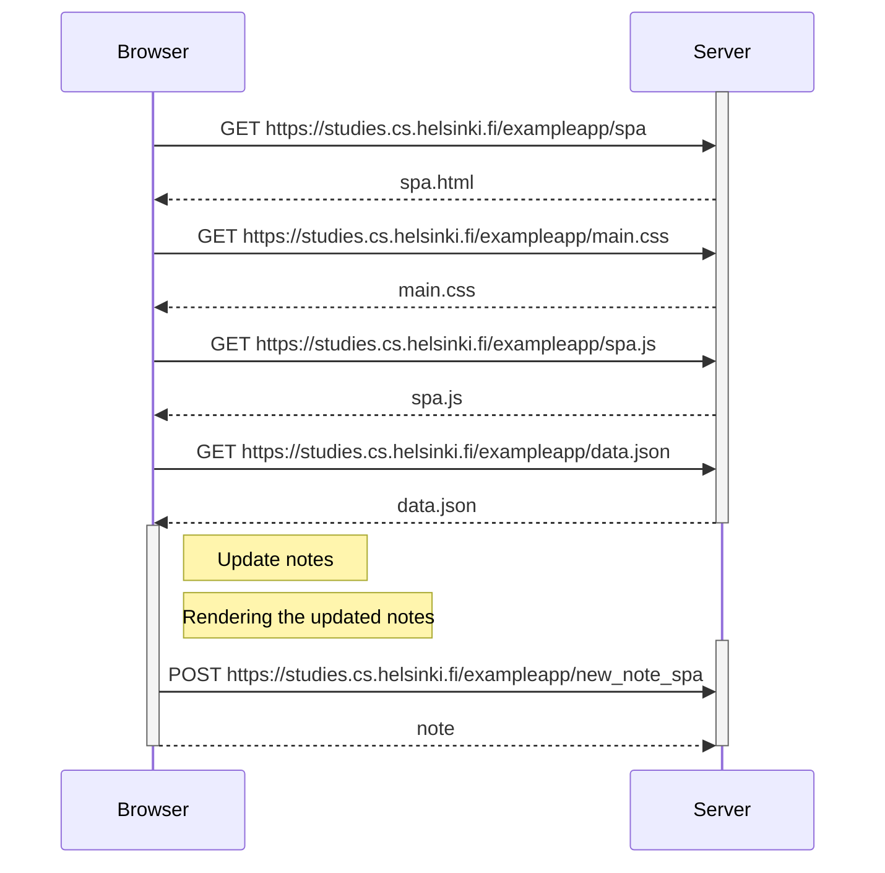

0.6: New note in Single page app diagram
Create a diagram depicting the situation where the user creates a new note using the single-page version of the app.

In this case, the head links to the main.css and spa.js files that are requested with a GET as in the original example. However, in the spa.js script
there is a variable << notes >> that seems to contain all information from the data.json file. The spa.js script contains also a function that seems to, first update the web app and later, send a file called note (maybe note.json) to the server for its treatment. The difference then is that the script spa.js contains all the functions to make the app work while in the previous version we saw, there was two different scripts in javascript, one in the browser to render the page and send any new << note >> to the server and another in the server to manage the notes and render the page and resend it to the browser. In this version, the page is rendered by the browser with the new data and sent to the server to just keep the << notes >> updated.

In this diagram, I have included what I believe it happens when a new note is added. On one hand, the note file is updated in the browser computer, the file is updated in the browser, the browser renders the notes again (reDrawnotes function in the spa.js file) and make a POST request to the server.

