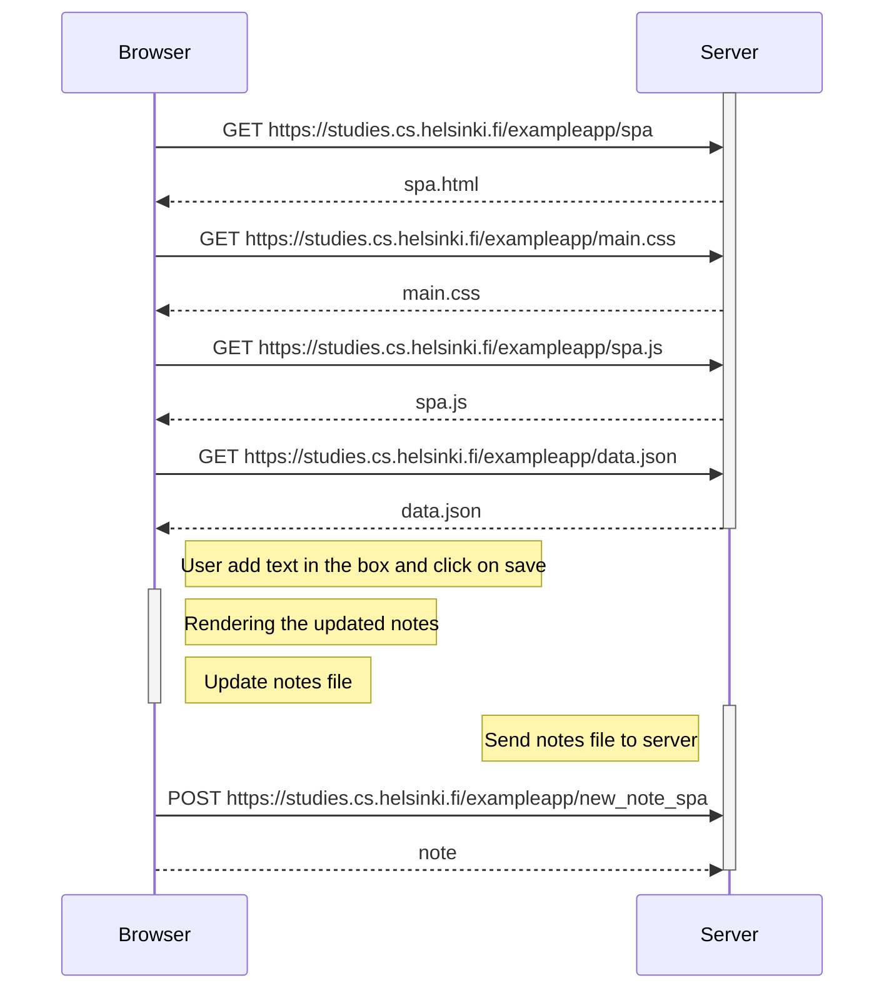

0.6: New note in Single page app diagram
Create a diagram depicting the situation where the user creates a new note using the single-page version of the app.

As we saw in the previous exercise, the GET request download the spa.html and due to its links, the main.css and spa.js. The javaScript file spa.js has functions to render the content of the data.json (the list of notes) so it prevents to get this done in the server (at least I believe so but I have not found a complete description of the process).

The spa.js script contains a function that seems to, first update the web app and later send POST request with a file called note (maybe note.json) to the server for its treatment. The updated seems to use a variable called note to contain all notes and be able to render it on the browser. Therefore, I would say (but not totally sure) that the server needs only to update the data.json for the other users of the app without any other modification.

In this diagram, I have included what I believe it happens when a new note is added. On one hand, the note file is updated in the browser computer, the file is updated in the browser, the browser renders the notes again (reDrawnotes function in the spa.js file) and make a POST request to the server.

